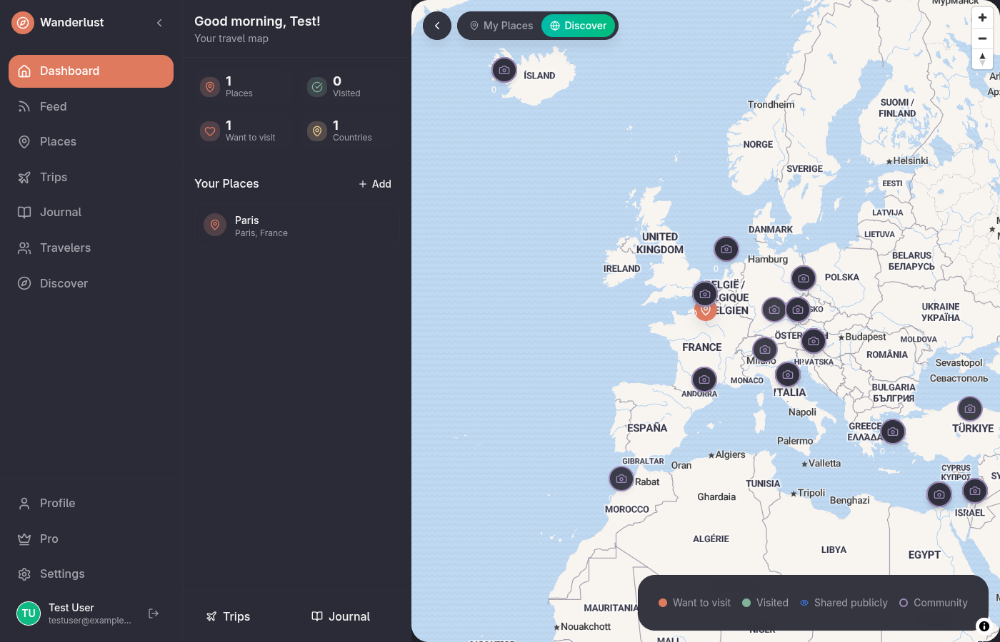
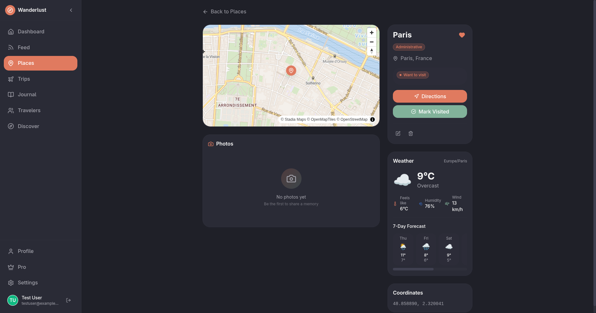
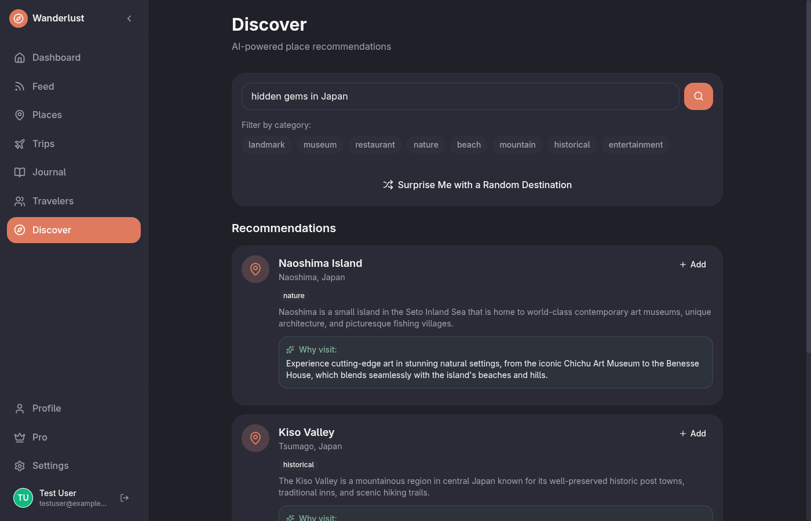
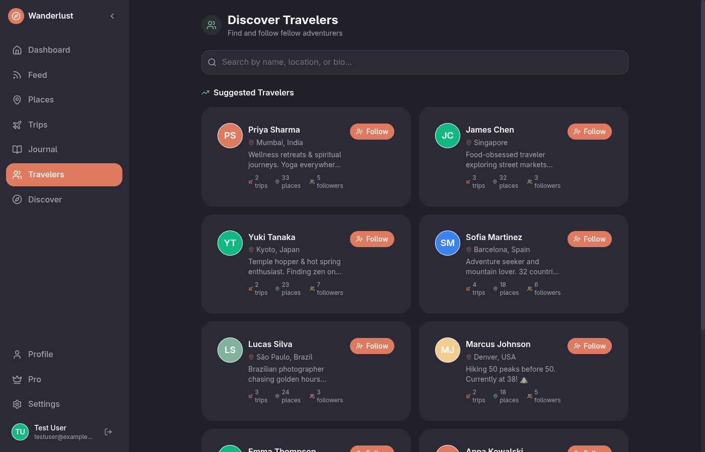
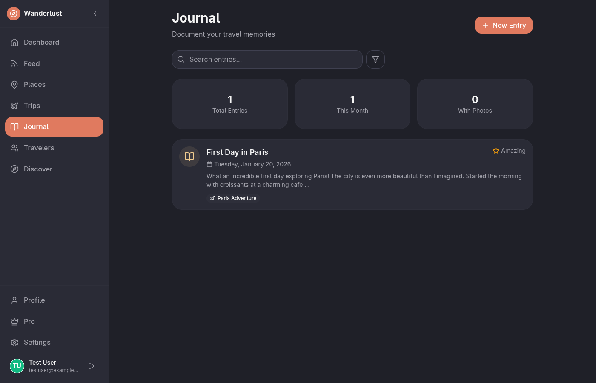

<p align="center">
  
</p>

<h1 align="center">Wanderlust</h1>

<p align="center">
  <strong>A self-hosted travel planning and journaling platform</strong>
</p>

<p align="center">
  Plan trips, track places, journal memories, and connect with fellow travelers — all on your own infrastructure.
</p>

<p align="center">
  
  
  
</p>

---

## Screenshots

<p align="center">
  
  <br />
  <em>Interactive map dashboard with community places from travelers worldwide</em>
</p>

<p align="center">
  
  <br />
  <em>Place details with live weather, 7-day forecast, and bucket list management</em>
</p>

<p align="center">
  
  <br />
  <em>AI-powered place recommendations and "Surprise Me" destination suggestions</em>
</p>

<p align="center">
  
  <br />
  <em>Connect with fellow adventurers and follow their journeys</em>
</p>

<p align="center">
  
  <br />
  <em>Document your travel memories with a rich journaling experience</em>
</p>

---

## Features

### Interactive World Map
- Visualize all your places on a beautiful interactive map
- **My Places** mode: See your personal bucket list
- **Discover** mode: Explore community places shared by other travelers
- Color-coded markers for visited vs want-to-visit places

### AI-Powered Discovery
- Get personalized place recommendations based on your interests
- **Surprise Me**: Let AI suggest hidden gems you've never heard of
- AI-generated itineraries for multi-day trips
- Auto-generated place descriptions

### Trip Planning
- Create and organize trips with dates, destinations, and activities
- Add places to your bucket list from a global POI database
- Track trip status: Planning, Active, Completed

### Travel Journal
- Document your experiences with a rich text editor
- Attach photos and link entries to trips and places
- Track your mood for each journal entry
- Search and filter through your memories

### Social Features
- Discover and follow other travelers
- Share your trips and places publicly
- Activity feed showing updates from people you follow
- Community-contributed place database

### Places & Bucket List
- Search global POI database (OpenStreetMap)
- Categorize places by type (restaurants, landmarks, nature, etc.)
- Mark places as "Want to Visit" or "Visited"
- Add ratings and personal notes
- Live weather data and 7-day forecasts

---

## Tech Stack

| Layer | Technology |
|-------|------------|
| **Frontend** | React 19 + TanStack Start + TanStack Query |
| **Backend** | Self-hosted Convex (serverless database + functions) |
| **Auth** | Better Auth (email/password, built-in) |
| **AI** | OpenRouter (Claude, GPT-4, etc.) |
| **Maps** | MapLibre GL + react-map-gl + Stadia Maps |
| **Weather** | Open-Meteo (free, no API key) |
| **Styling** | Tailwind CSS v4 |
| **Animations** | Framer Motion |
| **Deployment** | Docker + Docker Compose |

---

## Self-Hosted Deployment

Wanderlust is designed to be self-hosted. Run it on your own server, NAS, or cloud VM.

### Prerequisites

- Docker and Docker Compose
- Node.js 20+ (for development)

### Quick Start

```bash
# Clone the repository
git clone https://github.com/lukasz-sz96/wanderlust.git
cd wanderlust

# Copy environment template
cp .env.local.example .env

# Start all services
docker compose up -d

# Generate Convex admin key
docker compose exec convex-backend ./generate_admin_key.sh

# Add the generated key to .env file, then deploy functions
npm run deploy:self-hosted
```

### Services

| Service | URL | Description |
|---------|-----|-------------|
| Wanderlust App | http://localhost:3000 | Main application |
| Convex Dashboard | http://localhost:6791 | Database management UI |
| Convex API | http://localhost:3210 | Backend API |

### Unraid Deployment

Deploy Wanderlust on Unraid using Docker Compose.

#### 1. Clone Repository

```bash
cd /mnt/user/appdata
git clone https://github.com/lukasz-sz96/wanderlust.git
cd wanderlust
```

#### 2. Configure Environment

```bash
cat > .env << 'EOF'
VITE_CONVEX_URL=http://<UNRAID_IP>:3210
SITE_URL=http://<UNRAID_IP>:3000
BETTER_AUTH_SECRET=<32-character-secret>
EOF
```

Replace `<UNRAID_IP>` with your Unraid server's IP address.

#### 3. Build and Start Services

```bash
cd /mnt/user/appdata/wanderlust
docker compose up -d --build
```

The `--build` flag ensures the app is built with your custom `VITE_CONVEX_URL`.

#### 3. Generate Admin Key

```bash
docker compose exec convex-backend ./generate_admin_key.sh
```

Add the generated key to your `.env` file as `CONVEX_SELF_HOSTED_ADMIN_KEY`.

#### 4. Deploy Convex Functions

From a machine with Node.js installed:

```bash
git clone https://github.com/lukasz-sz96/wanderlust.git
cd wanderlust
npm install
CONVEX_SELF_HOSTED_URL=http://<UNRAID_IP>:3210 \
CONVEX_SELF_HOSTED_ADMIN_KEY=<generated-key> \
npx convex deploy
```

#### Optional Environment Variables

Add these to your `.env` file to enable additional features:

```bash
OPENROUTER_API_KEY=sk-or-...        # AI recommendations
VITE_STADIA_API_KEY=...             # Custom map tiles
VITE_MAPILLARY_ACCESS_TOKEN=...     # Street-level imagery
```

---

## Environment Variables

Create a `.env` file with the following variables:

```bash
# Convex Self-Hosted
CONVEX_SELF_HOSTED_URL=http://localhost:3210
CONVEX_SELF_HOSTED_ADMIN_KEY=<generated-admin-key>
VITE_CONVEX_URL=http://localhost:3210

# Better Auth
SITE_URL=http://localhost:3000
BETTER_AUTH_SECRET=<32-character-secret>

# AI (Optional - for recommendations)
OPENROUTER_API_KEY=sk-or-...

# Map Services (Optional)
VITE_STADIA_API_KEY=<your-stadia-key>
VITE_MAPILLARY_ACCESS_TOKEN=<your-mapillary-token>
```

---

## Development

```bash
# Install dependencies
npm install

# Start development servers (frontend + Convex)
npm run dev

# Frontend only
npm run dev:frontend

# Convex backend only
npm run dev:backend

# Build for production
npm run build

# Format code
npm run format

# Lint and type-check
npm run lint
```

---

## Project Structure

```
wanderlust/
├── convex/              # Convex backend (schema, functions)
│   ├── schema.ts        # Database schema
│   ├── auth.ts          # Authentication config
│   ├── ai.ts            # AI-powered features
│   └── *.ts             # Queries, mutations, actions
├── src/
│   ├── components/      # React components
│   │   ├── maps/        # Map components
│   │   ├── places/      # Place management
│   │   ├── weather/     # Weather widgets
│   │   └── ui/          # Reusable UI components
│   ├── routes/          # TanStack file-based routing
│   ├── lib/             # Utilities and hooks
│   └── app.css          # Global styles
├── docs/                # Documentation
├── docker-compose.yml   # Docker services
└── Dockerfile           # App container
```

---

## License

MIT License - See [LICENSE](LICENSE) for details.

---

<p align="center">
  <strong>Built with privacy in mind. Your data stays on your server.</strong>
</p>
